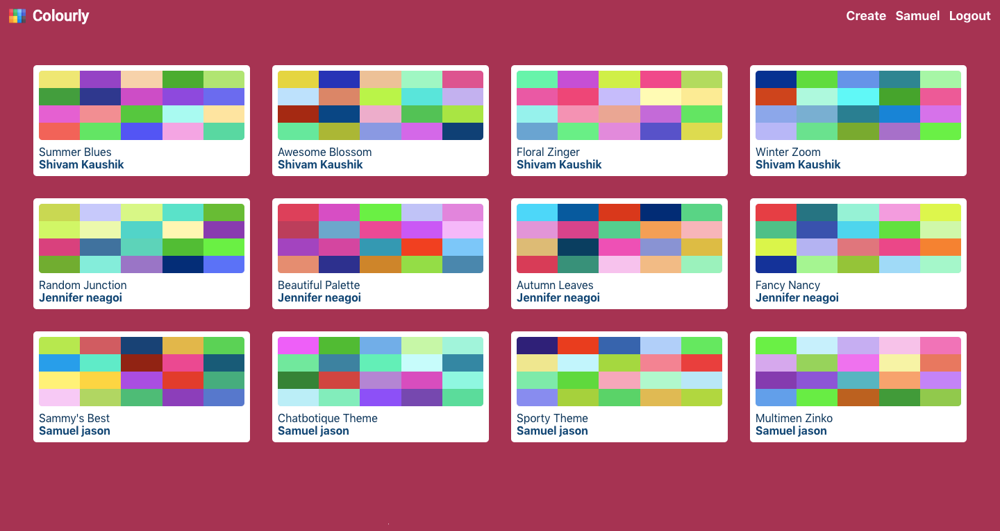

# Colourly - All in one Palette management

[Colourly](https://colourly.herokuapp.com/)



## Table of content

- [Description](#description)
- [Technologies](#technologies)
- [Installation](#installation)
- [Contact](#contact)

## Description

Colourly is a palette management app build using the MERN stack. It lets you:

1. Create new palettes with a very advanced color picker and naming mechanism
2. Manage your own palettes (Create, Update, View and Delete)
3. View palettes uploaded by other users
4. view various different shades of the palette colors
5. Convert palette colors to different formats

## Technologies

The project is built using the MERN Stack.

### Features - MERN

#### Express, MongoDB, Mongoose, NodeJS

- API
  `CRUD`, `Filtering`, `Pagination`, `Projection`, `Sorting`, `Aliasing`, `Aggregation`, `Advanced modelling`, `populating`, `geolocation`
- Authentication
  `sign-up`, `login`, `authorization`, `jwt`, `forget password`, `reset password`, `update password`, `update account`, `reset account`
- Security
  `cors`, `rate limiting`, `cookie`, `http headers`, `data sanitize`, `parameter pollution prevention`
- Advance Error Handling

#### React

- `ReactJS`, `Redux`, `Material-ui`

## Installation

1. Clone the project to your local directory

```
git clone https://github.com/KaushikShivam/Colourly
```

2. The project uses NPM for managing dependencies. Run npm install to install all the required dependencies

```
npm install
```

3. Navigate into the client directory

```
npm run dev
```

## Contact

You can contact me at:

- [Portfolio](www.shivamkaushik.com)
- [Email](shivamkaushikofficial@gmail.com)
- [Linkedin](https://www.linkedin.com/in/kshivamdev/)
- [Twitter](https://twitter.com/kShivamDev)
- [Medium](https://medium.com/@shivamkaushikofficial)
- [Angellist](https://angel.co/kshivamdev)
